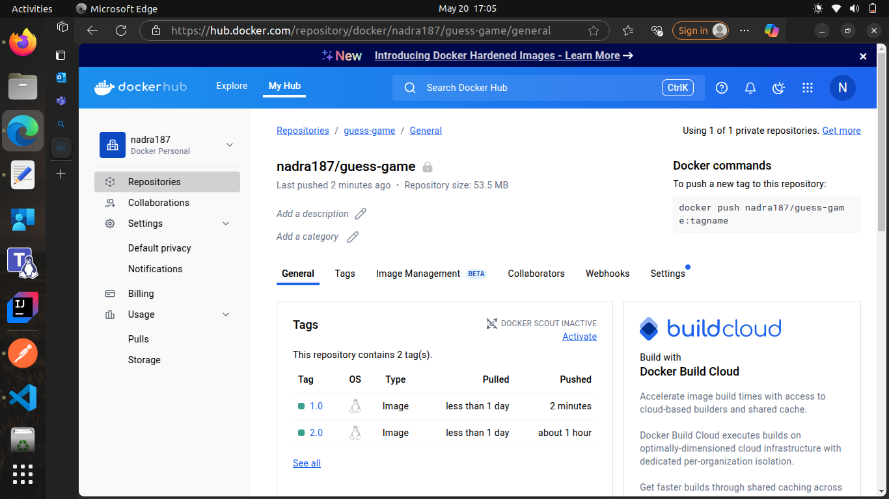
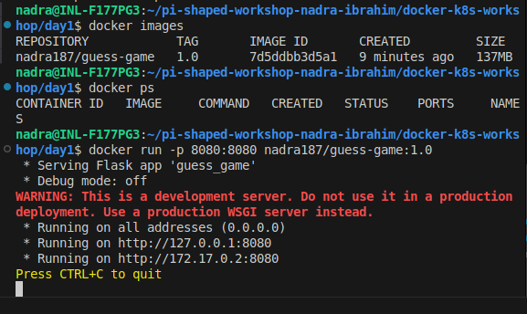
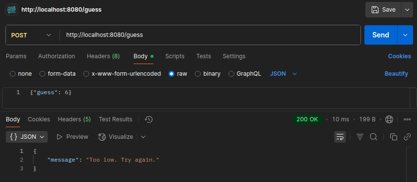

# Pi-shaped workshop: Day 1 Assignment

This is a simple Flask-based web application that implements a number-guessing game. The server generates a random number between 1 and 10, and users can guess the number by sending HTTP requests to the API.


## Ques 1 : Why is Docker useful in building and deploying microservices for a real-world product (like an e-commerce or banking app)?

Docker is useful for building and deploying microservices because it lets each service run in its own isolated, lightweight container with all its dependencies. This means consistent behavior across dev, test, and prod environments, faster deployments, easier scaling, and simpler updates. It works well with CI/CD and cloud platforms, making it ideal for managing complex apps like e-commerce or banking systems where reliability and speed matter.

---

## Ques 2 : What is the difference between a Docker image and a container in the context of scaling a web application?
A Docker image is a snapshot — it’s the blueprint or read-only template with the app code, libraries, and environment setup. A container is a running instance of that image — it's live, doing the work.

In the context of scaling a web app:

    You build the image once (e.g., your web service).

    You run multiple containers from that image to handle more traffic.

So, when scaling, you're not copying or rebuilding the app — you're just spinning up more containers from the same image. The image stays static; containers are dynamic and can be created or destroyed as needed.

---

## Ques 3 : How does Kubernetes complement Docker when running a product at scale (e.g., hundreds of containers)?
Docker handles building and running containers, but when you're running hundreds of containers, managing them manually becomes a nightmare. That’s where Kubernetes steps in.

Kubernetes complements Docker by automating:

    Deployment – it rolls out updates, restarts failed containers, and manages app versions.

    Scaling – it can auto-scale containers up or down based on traffic/load.

    Load balancing – it distributes traffic evenly across containers.

    Self-healing – if a container crashes, Kubernetes replaces it automatically.

    Service discovery & networking – it helps containers find and talk to each other reliably.

In short: Docker runs containers, Kubernetes manages them at scale — making your product stable, responsive, and easier to operate in production.

---

## Build & Push Log

```
nadra@INL-F177PG3:~/pi-shaped-workshop-nadra-ibrahim/docker-k8s-workshop/day1$ docker build -t nadra187/guess-game:1.0 .
[+] Building 7.1s (10/10) FINISHED                    docker:default
 => [internal] load build definition from Dockerfile            0.0s
 => => transferring dockerfile: 380B                            0.0s
 => [internal] load metadata for docker.io/library/python:3.9-  2.0s
 => [auth] library/python:pull token for registry-1.docker.io   0.0s
 => [internal] load .dockerignore                               0.0s
 => => transferring context: 2B                                 0.0s
 => [1/4] FROM docker.io/library/python:3.9-slim@sha256:bef8d6  0.0s
 => [internal] load build context                               0.0s
 => => transferring context: 2.94kB                             0.0s
 => CACHED [2/4] WORKDIR /app                                   0.0s
 => [3/4] COPY . /app                                           0.0s
 => [4/4] RUN pip install flask                                 4.9s
 => exporting to image                                          0.1s 
 => => exporting layers                                         0.1s 
 => => writing image sha256:7d5ddbb3d5a137d9f48a7dbe70987b9e37  0.0s 
 => => naming to docker.io/nadra187/guess-game:1.0              0.0s 
nadra@INL-F177PG3:~/pi-shaped-workshop-nadra-ibrahim/docker-k8s-workshop/day1$ docker push nadra187/guess-game:1.0
The push refers to repository [docker.io/nadra187/guess-game]
2f3494bd428d: Pushed 
da3f5c287c5a: Pushed 
52e97611748c: Layer already exists 
678221e973fe: Layer already exists 
529e75018436: Layer already exists 
41757dc445c9: Layer already exists 
6c4c763d22d0: Layer already exists 
1.0: digest: sha256:4b2479c710b19666d0be42398ac66bde51fc696e16a148040c0f2fddddff48ed size: 1784
```

### Screenshot Example:

**Image on Docker Hub**


**Starting the app on post 8080**


**Guess the number through API**


---

## Docker Hub Image

🛆 **Link**: [The link of the image on docker hub](https://hub.docker.com/repository/docker/nadra187/guess-game/general)

---

