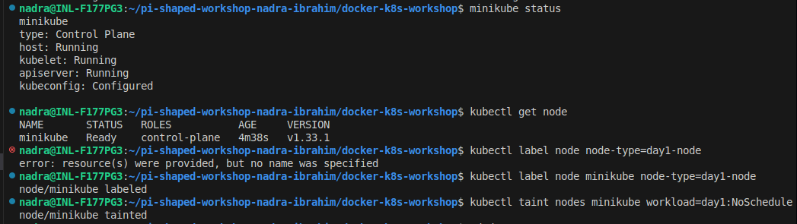
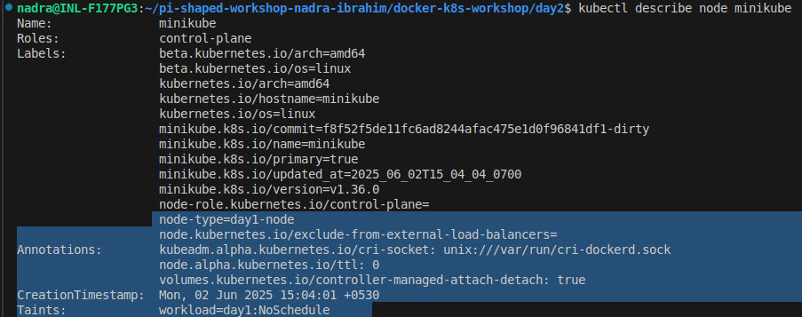
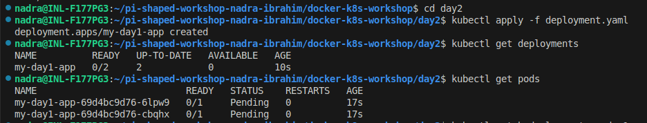
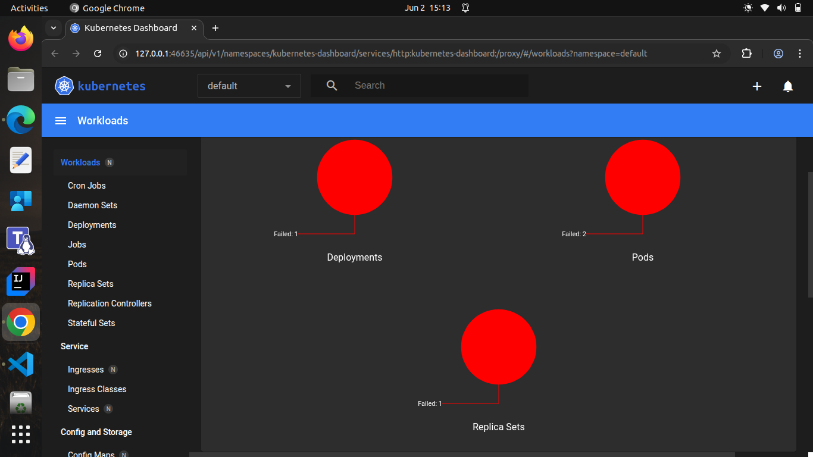
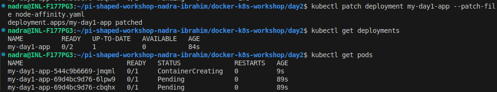
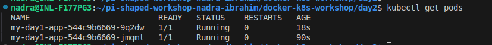
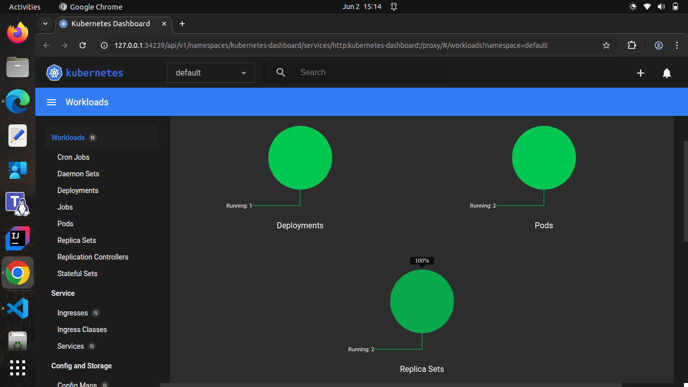

# Pi-shaped workshop: Day 2 Assignment

This project deploys the **Day 1 app** on Kubernetes with resource constraints, node affinity, and tolerations. It uses a modular YAML structure to separate the deployment configuration from scheduling constraints, instead of using a single file for both of them.

---

## Core Concept Questions

### 1. Why do we set requests and limits for CPU/memory in a production-grade product?

Setting **CPU and memory requests/limits** ensures:
- **Resource isolation**: Prevents one container from consuming all node resources.
- **Stable scheduling**: Scheduler places pods based on available capacity.
- **Predictability**: Helps in performance tuning and cost control.
- **Avoids throttling or OOMKills**: Too low limits can cause poor performance or crashes.

---

### 2. When would a product team apply node affinity in Kubernetes?

Teams use **node affinity** to:
- **Run workloads on specific node types** (e.g., SSD nodes, GPU nodes).
- **Enforce compliance** (e.g., storing data in certain regions or zones).
- **Separate environments** (e.g., QA on `qa-nodes`, prod on `prod-nodes`).
- **Optimize performance** by aligning with node capabilities.

---
## Deployment Flow on Minikube with Node Affinity and Tolerations

### Step 1: Labeled and Tainted the Node

Since Minikube runs on a single node (`minikube`), we labeled and tainted it to simulate a production-like scheduling environment:

#### Verify the node label and taint

---

### Step 2: Applied Basic Deployment

Our deployment file (deployment.yaml) includes the container screenshots/image and resource limits and requests. But does NOT include nodeAffinity and tolerations. Hence, the pods will be created, but won't be running.

#### Failed Deployment

---

### Step 3: Patch the Deployment with node-affinity.yaml

To fix the scheduling issue, i have patched the deployment using the node-affinity configuration file.

After some seconds, the older pods are terminated and new pods were created and  started running. 

####  Successful deployment

