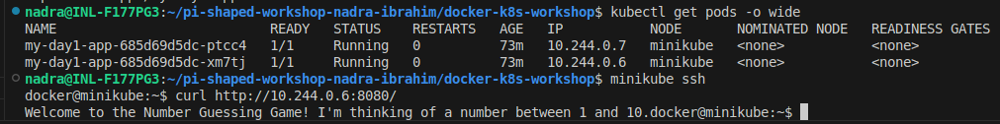
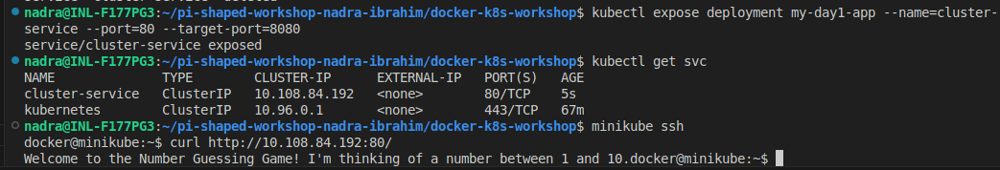
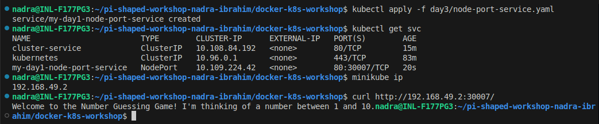
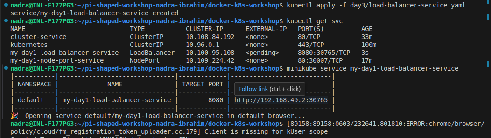
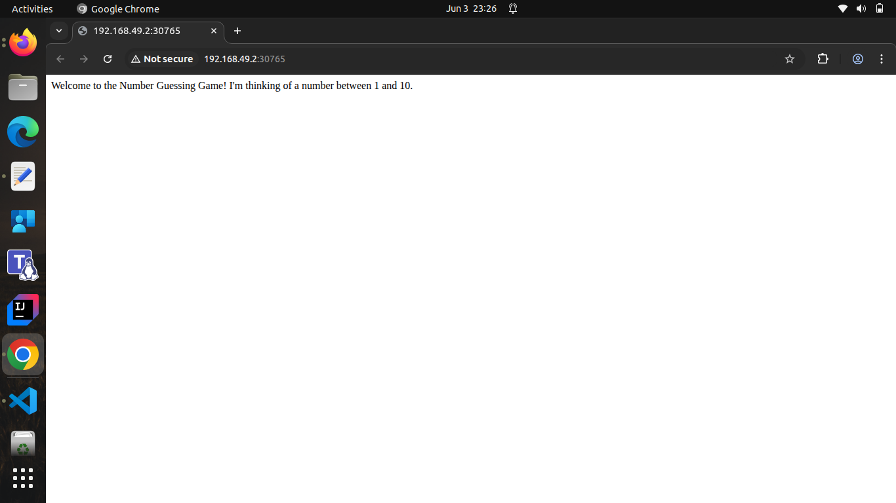
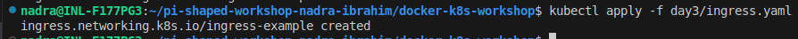
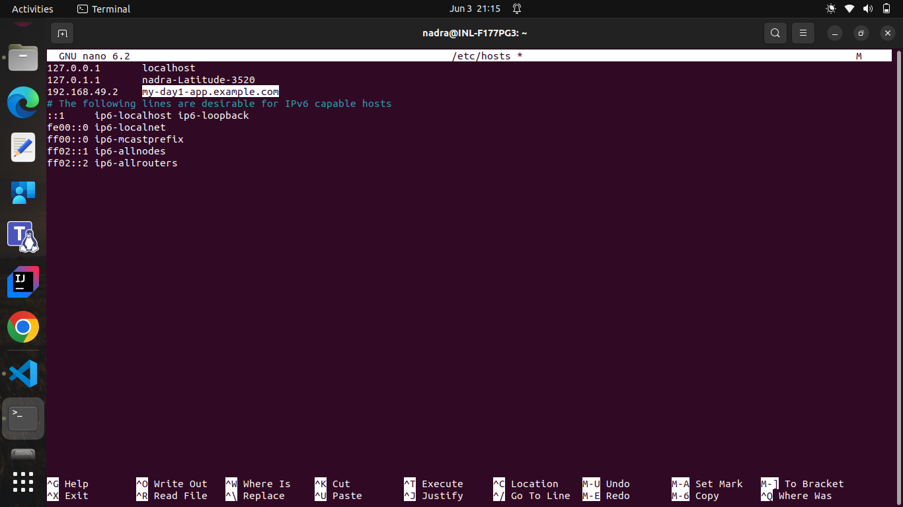
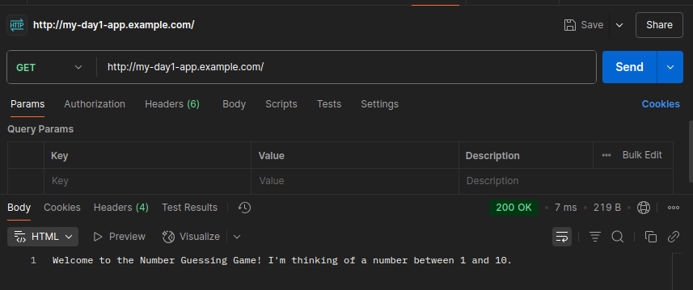
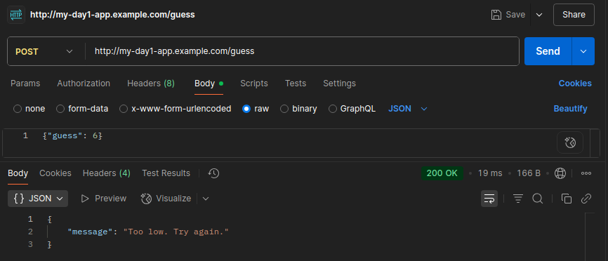

# Pi-shaped workshop: Day 3 Assignment

This project demonstrates how to expose a simple app in Kubernetes using different service types and Ingress. 

---
## Core Concept Questions

### 1. How would you expose an internal microservice (e.g., user-auth) differently from a public-facing frontend?

- Internal services (like user-auth) should use ClusterIP or be hidden behind Ingress rules with authentication.
- Public-facing services (like a frontend UI) use Ingress or LoadBalancer for external exposure.

---

### 2. Why use Ingress instead of exposing each microservice via LoadBalancer?

- Ingress allows:
    - Centralized routing via one LoadBalancer/IP.
    - TLS termination in one place.
    - Path-based or host-based rules.
    - Cost saving vs many LoadBalancers.
- LoadBalancer for each service is expensive and unscalable.

---
## Access Python App on Minikube

### Approach 1 : Access via Pod IP

- The most basic method is to access the pod directly on which the app is deployed. 
- Given that the python app is listening on the port 8080 and is exposed in the docker file. 
- For this approach, ssh the node and curl the pod ip with pod port.

### Why It's Not Ideal in Practice

- Pod IPs are temporary and change when pods restart or reschedule.
- They are only accessible within the cluster, not from outside.
- No built-in DNS or load balancing when using Pod IPs.
- Kubernetes Services provide stable access and traffic distribution.

---
### Approach 2 : Access via ClusterIP 

- Another basic way is to create the service, by default, the ClusterIP is created. 
- We can create the service with command or through the file. 
- Once the Service is created, you can access the app using its ClusterIP and port, but **only from inside the cluster**. 

---
### Approach 3 : Access via NodePort

We can also expose a port on node to facilitate the pod access. This is not recommend. The range of node ports is 30000 to 32676. just get the node ip with node port

- We can also expose a port on the node to access the pod using a NodePort service. 
- Exposing the pod directly via a NodePort on the node is generally **not the right approach**.
- NodePorts allocate a port from the range 30000–32767 and forward traffic to the target pod.
- curl the node IP with node exposed port.

---
### Approach 4 : Access via LoadBalancer

A LoadBalancer is a Kubernetes service type that exposes the app to the external world by provisioning an external IP. However, since we're using Minikube (not a cloud provider), an external IP is not assigned automatically. Instead, we can use:
- The command minikube service <service-name> to open the app in a browser or get a usable local URL.
- Or SSH into Minikube and curl using the Node IP and NodePort.

---
## Configure Ingress to route traffic to your app using a path-based rule 

- Step 1 : Install Ingress Controller 
- Step 2 : Create Ingress Resource file
- Step 3 : Apply the Ingress

- Step 4 : Update /etc/hosts to map my-day1-app.example.com to the external IP of your ingress controller

- Step 5 : Access the controller using the domain and see the traffic directed to the python app.

---
## URL Paths & Expected Responses
| URL                                         | Method | Request Body                        | Expected Response Example                              |
|---------------------------------------------|--------|-------------------------------------|--------------------------------------------------------|
| http://my-day1-app.example.com/             | GET    | –                                   | Welcome to the Number Guessing Game! I'm thinking of a number between 1 and 10 |
| http://my-day1-app.example.com/guess        | POST   | `{ "guess": 7 }`                    | `{ "message": "Too low. Try again." }` OR `{ "message": "Correct! You guessed it in 3 tries." }` |

