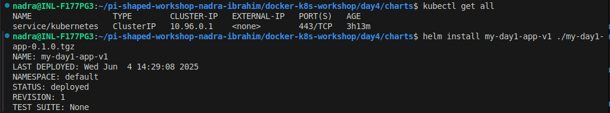

# # Pi-shaped workshop: Day 4 Assignment

This project demonstrates packaging a simple Python Flask-based number guessing game using **Helm** for Kubernetes deployment. It shows how to parameterize configuration for flexible and reusable deployments.

---
## Core Concept Questions

### 1. Why is Helm important for managing configuration across different environments in a real-world product (e.g., dev, staging, prod)?

Helm allows you to parameterize configurations using values.yaml, making it easy to define environment-specific settings like image tags, replica counts, or environment variables. Instead of duplicating YAML files for each environment (dev, staging, prod), you can reuse the same Helm chart with different values.yaml files. This promotes consistency, reduces errors, and simplifies CI/CD pipelines.

---

### 2. How does Helm simplify deployment rollback during a production incident?

Helm tracks every release as a versioned deployment. If a new deployment causes issues, you can quickly roll back to a previous stable state using a single command:
```bash
helm rollback <release-name> <revision-number>
```
This built-in version control helps minimize downtime and speeds up recovery during production incidents.

---
## Installing a NGINX Controller from bitnami Repo

### Install Helm 

Helm is a package manager for Kubernetes. It simplifies the process of deploying and managing applications on Kubernetes clusters. 


---
### Add Repository

As current kuberentes context is minikube, so by default helm will be installed on minikube cluster only. Then we will add Bitnami repo. Bitnami provides pre-packaged Helm charts for many popular applications like MySQL, WordPress, Kafka, etc.


---
### Install NGINX Controller

Search the controller and install it


---
### Verify Installation


---

## Create, Package and install the Helm chart

### Create Helm Chart

When we use helm create command. This generates all the required files and directory structure.


---
### Update the template files

Navigate to the templates/ directory — this contains all the Kubernetes manifests.
Edit deployment.yaml and service.yaml to replace hardcoded values with variables from values.yaml.
Delete any files we don’t need (e.g., hpa.yaml, serviceaccount.yaml, etc.).


---
### Parameterize Configuration in values.yaml

Set the actual values (e.g., image name, replica count, ports) in values.yaml.
These values will be injected into the templates during deployment.


---
### Package the helm chart


---
### Install the packaged chart


---
### Verify the pods and services


---
### Access the app via LoadBalancer service


---
### Upgrade the deployment via Helm


---