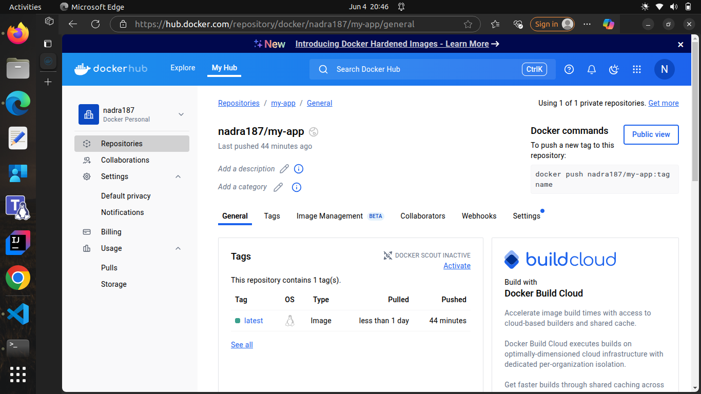

# Pi-shaped workshop: Day 5 Assignment

This project deploys a simple two-tier web application using:
- **Flask (backend)**
- **NGINX (frontend proxy)**
- **Kubernetes** with Helm or raw manifests

---
## Core Concept Questions

### 1. Why are liveness and readiness probes critical in keeping a product’s user experience stable and reliable?

Liveness Probes - Ensuring Application Health:

Liveness probes are essential for maintaining service reliability by detecting and recovering from application failures automatically. Here's why they're critical:

***Automatic Failure Recovery:***

Problem: Applications can become unresponsive due to memory leaks, deadlocks, or infinite loops
Solution: Liveness probes detect these "zombie" states and restart containers automatically
User Impact: Prevents users from experiencing timeouts or hanging requests
Reduced Mean Time to Recovery (MTTR):

Traditional Approach: Manual detection and restart (minutes to hours)
With Liveness Probes: Automatic detection and restart (seconds to minutes)
Business Value: Minimizes revenue loss during outages

```bash
livenessProbe:
  httpGet:
    path: /
    port: 5000
  initialDelaySeconds: 15    # Wait 15 sec after container starts before first check
  periodSeconds: 20          # Check every 20 seconds
  timeoutSeconds: 5          # Timeout if no response within 5 sec
  failureThreshold: 3        # After 3 failures, restart the container
```

***Readiness Probes - Traffic Management:***

Readiness probes ensure users never hit pods that aren't ready to serve requests:

***Zero-Downtime Deployments:***

During Updates: New pods only receive traffic when fully initialized
During Scaling: Pods are added to load balancer only when ready
During Startup: Prevents routing to pods still loading dependencies
Load Balancer Intelligence:

Healthy Pods: Receive traffic normally
Unhealthy Pods: Automatically removed from rotation
Recovery: Automatically re-added when health is restored
Critical Scenarios:

Database Connection: Pod needs time to establish DB connections
Cache Warming: Application needs to populate caches before serving traffic
Service Dependencies: Waiting for dependent services to be available
Resource Initialization: Loading configuration files or initializing memory structures
Combined Impact on User Experience:

No 5xx Errors: Users never hit unhealthy or unready pods
Consistent Performance: Traffic only goes to fully functional pods
Automatic Recovery: Self-healing system reduces operational overhead
Reliable Deployments: Updates happen without service interruption

---

### 2. How does HPA help in handling flash sales, seasonal load spikes, or traffic surges in real-world applications like an e-commerce platform?

HPA helps by automatically increasing the number of running pods when traffic spikes—like during flash sales or seasonal events—so the app can handle more users without slowing down. When demand drops, HPA scales pods back down to save resources and costs. This dynamic scaling keeps the app responsive and stable during sudden surges without needing manual intervention.

---
## Architecture

Client → NGINX (Deployment + Service) → Flask (Deployment + Service)

- **Flask**: Python backend running on port 5000
- **NGINX**: Lightweight reverse proxy forwarding requests to Flask
- **Kubernetes Features**:
  - Separate Deployments and Services
  - Liveness and Readiness Probes
  - Resource Requests and Limits
  - Horizontal Pod Autoscaler (HPA) on Flask

---
## Setup Instructions

### Build and push Flask Docker image


---
### Create Kubernetes objects


---
### Access the frontend


---

## 🚀 Optimization Strategies Implemented

### ✅ Resource Requests and Limits

***Flask (Backend)***:

```yaml
resources:
  requests:
    memory: "64Mi"
    cpu: "250m"
  limits:
    memory: "128Mi"
    cpu: "500m"
```

- Ensures the pod always has at least 250 millicores and 64Mi memory.
- Limits usage to 500 millicores and 128Mi memory, preventing resource overuse.
- Useful for lightweight APIs or simple apps with moderate traffic.

***NGINX (Frontend Proxy)***:

```yaml
resources:
  requests:
    cpu: "50m"
    memory: "64Mi"
  limits:
    cpu: "100m"
    memory: "128Mi"
```

- Allocates minimal CPU/memory since NGINX mainly handles HTTP routing.
- Suitable for cost-efficient reverse proxying in small environments.

***HPA*** auto-scales Flask pods based on CPU load (50% threshold).

---    
    
## METRIC SERVER

### Addon metric server


---    
### Sending too many requests to the service 


---    
### Check CPU usage reported by metrics-server
Given i have set the replicas to 1 in the deployment file, but when i have sent too many requests, i can see the pods scaling up automatically as per the need.


---    
### HPA


---    
### Minikube dashboard: metric server


---    